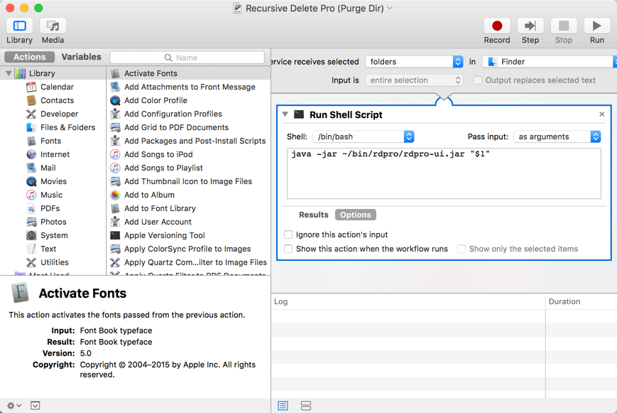

## What is RdPro (Recursive Directory Removal Pro)

* A Recursive Directory Removal/Purge Utility.  It transverses huge directory structures to find and purge mathed directories and files buried deep. 
* Super-fast. faster than the linux "rm" command.  Multiple threads are used to perform tasks in parallel. Algorithm makes a difference! 
* Can remove a directory user specified which is nested and spread out under a huge directory structure. I found rm is lacking on this feature and it is the main driver for me to start writing this tool. For exmaple, it allows me to remove all the maven created target directories (which contains classes) under all my projects so that allows me to back up the source code only wihtout the generated classes. 
* No problem removing files and directories with long names which windows sometime can't handle.  No more “The file name is too long" issue. 
* The deleted files do not go to the recycle bin and can't be recovered. Make sure you read the disclaimer and understand what to expect. 

## OS 
*  Cross platform. It is a java application and can run on all the platforms where java is supported. Requires JRE/JDK to be installed on the machine for it to run:
*  Windows 
*  Linux/Unix
*  Mac

## Tech Stack
The project is a good showcase of the 
* GUI builder with maven in IntelliJ IDEA to build a Swing GUI.
* Multi threading using java concurrent ThreadPoolExecutor to performs tasks in parallel.
* Recursive walk algorithem.

## Download

- [Downlod the latest release] (https://github.com/mhisoft/rdpro/releases)
- The latest snapshot version is available under the dist/ folder.

There is a windows executable, batch files and Unix/Linux shell script included to run the application. Unzip and put the files in a directory on the environment path. 

## How to run

If not already, down load and install the latest JRE/JDK 1.7+ from Oracle.

Open the console and go to the directory which you want to purge and run the rdpro.exe.  Run rdpro.sh in unix/linux environment. see below for examples.

## The GUI version 
run the rdproui.exe or rdproui.sh/rdproui.bat for your operating system. 


## Hook to the Windows Explorer Context menu
- Edit the repro_reg.reg file change the path to point to where your rdpro is exploded.
double click to import into windows registry
- Right click on the direcotry you want ot purge, you will see the "Recursive Delete Directory" context menu
- click it to popup the rdpro GUI.

.png "Windows exploer context menu")

## Hook into the Context menu on Mac
* Use automator to create a Service. Follow the below screenshot.
Choose the type of Document, say "Add Service". Select Folders, "In Finder". on the left select "Run Shell Scripts".Edit the path to where you installed the jar.
* Right click on a folder in the Mac Finder, Services, The Recursive Delete Pro menu should be available . This is the name you choose to save in the Automator.  The rdpro should popup with the folder pre populated. 


## linux/mac command line 
explode the release to [home]/bin/rdpro for example, then update jar location in the the rdpro.sh to where the jar is
such as :
       `java -jar ~/bin/rdpro/rdpro-ui.jar  "$1" "$2" "$3" "$4" "$5"`

then you can go to the directory where you want to start to delete and issue rdpro.sh 

$ rdpro.sh -h

```
RdPro v1.2.2  - A Powerful Recursive Directory Purge Utility by Tony Xue, MHISoft
Disclaimer:
	Purged files does not go to recycle bin so can't be recovered.
	It works and well tested. But still use it at your own risk. The author is not responsible for any lost of files or damage incurred by running this utility.
Usages:
    rdpro [option] path-to-search [target-dir] 
	 path-to-search  root directory where to start the search, default to the current dir.
	 -d/-dir specify the target dir. only directories with the matched name with this target dir will be removed.  
	 -tf     target file match patterns. Use comma to delimit multiple file match patterns. ex: *.repositories,*.log
	         if not specified, all files under the matched dir will be removed. 
	 -f      force delete without confirmations. 
	 -i      interactive, default istrue
	 -v      verbose mode
	If can't remove the file or directory it could be locked or you don't have permission. Try use root account "sudo"
Examples:
	Remove everything under a dir (purge a directory and everything under it): rdpro c:\mytempfiles
	Remove all directories that matches a specified name recursively: 
		rdpro s:\projects -d target 
		rdpro s:\projects target
      
```       

##  Windows, The command line version rdpro.exe
add the path to the rdpro to the path enviroment variable. then  use "rdpro" in  the command from anywhere. 


## ex: Force delete the "target" directories 

```
	S:\src\6.3-trunk>rdpro target -f
	Start to delete all the directories named "target" under "S:\src\6.3-trunk".
	There is no way to undelete, please confirm? (y/n or h for help)y
	working|
	Done in 10 seconds.
	Dir Removed:3944, Files removed:28690
```

## Purge an old huge directory in whole

```
	S:\src\b1210-trunk>rdpro

	Start to delete everything under "S:\src\b1210-trunk" (y/n or h for help)?y
 	*Warning* There is no way to undelete. Confirm again (y/n or h for help)?y
	working.
	Confirm to delete file:S:\src\b1210-trunk\.externals(y/n/all)?dfd
        	response "dfd" not recognized. input again:all
	-
	Done in 29 seconds.
	Dir Removed:14285, Files removed:84409
```


If somehow it leaves some empty directory after running it, make sure they are locked and run it again. 

## Disclaimer
Deleted files do not go to recycle bin and can't be recovered.The author is not responsible for any loss of files or damage incurred by running this utility.

## License
Apache License 2.0, January 2004 http://www.apache.org/licenses/
